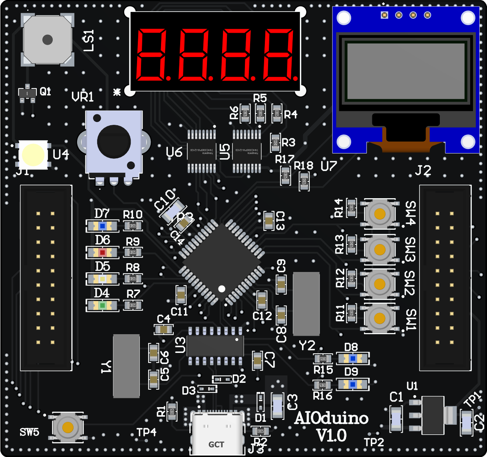
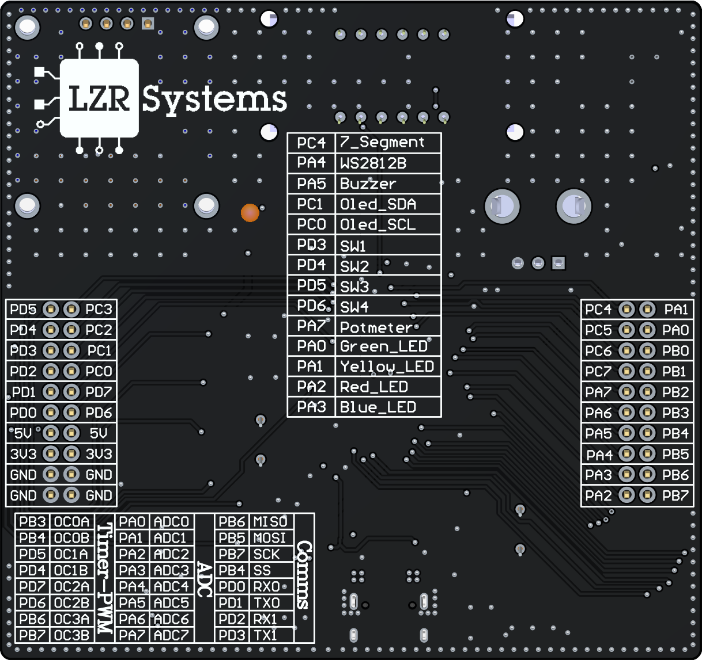
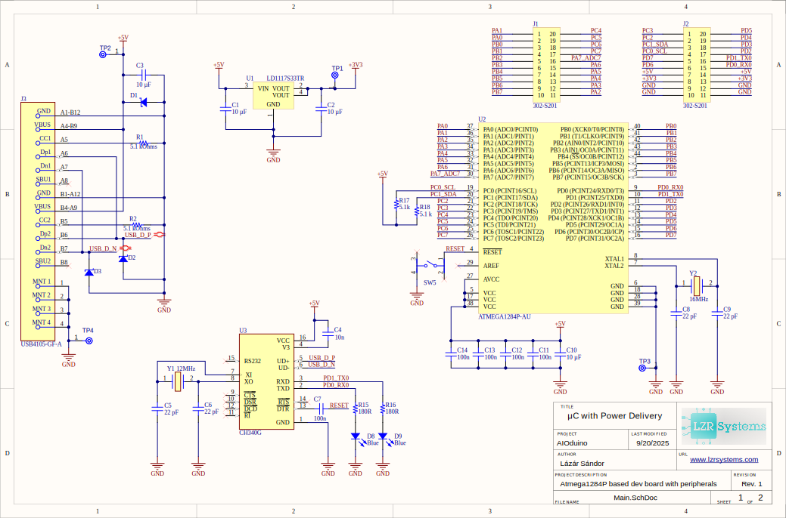
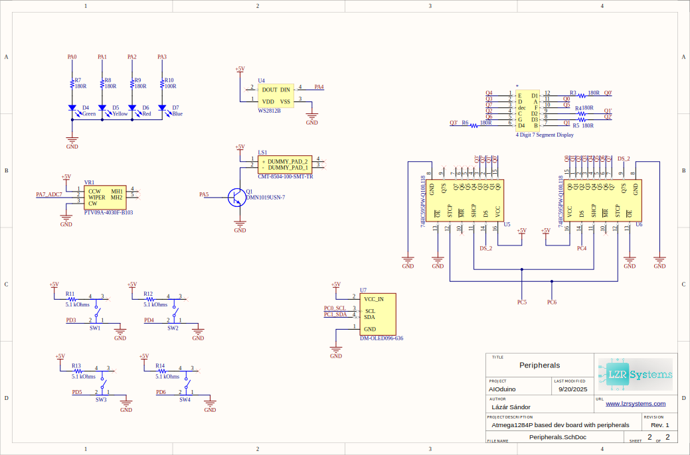

### AIODuino is an **ATmega1284P-based development board** with built-in peripherals for embedded projects. It combines common hardware modules into a single board, making it easy to prototype and test firmware without external shields.

## 🤌Features
- **Microcontroller**: ATmega1284P-AU (40 GPIO, 16 KB SRAM, 128 KB Flash)
- **Peripherals onboard**:
  - 4-digit 7-segment LED display
  - 0.96" OLED display (SSD1306-I²C)
  - Potentiometer
  - Piezo buzzer
  - 4 push buttons + reset button
  - 4 Color LEDs + UART indicator LEDs
  - WS2812B addressable RGB LED
- **Interfaces**:
  - Dual 2×10 pin headers for expansion
  - USB connector (power + UART bridge)
- **Clock**: 16 MHz crystal
- **Power**: 5 V via USB or external supply
- **Onboard 3.3V LDO**

## 🔧Hardware

### PCB 3D Render

### 📝 Schematics
  

## Credits
This project uses the [MightyCore](https://github.com/MCUdude/MightyCore) Arduino core by [MCUdude](https://github.com/MCUdude) for uploading code on the board

## Examples
### Currently waiting for the board to arrive, I'll try to make examples in AVR-C as soon as it arrives.

## Repository Contents
- `*.SchDoc` – Altium schematic files  
- `*.PcbDoc` – Altium PCB file  
- `GERBER/` – Gerber outputs (for fabrication)  
- `Pictures/` – Schematics and board previews (SVG, PNG) 